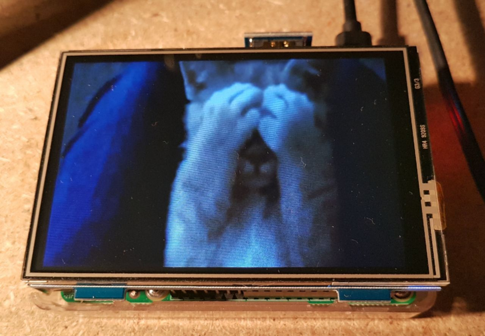

# DisplayBot

This script runs on a Raspberry Pi and provides a fullscreen infinite gif loop
as well as a webradio. Both can be accessed and controlled through a Telegram bot.

# Installation

First, install `mplayer`, `omxplayer` and `ffmpeg` through a package manager. Then clone 
displaybot to `~/displaybot` and make a Python 3 virtual environment for it.

Then

    $ pip install -r requirements.txt

Finally

    $ ./scripts/setup.sh

This script creates folders for the clips, asks you for a Telegram bot API token
(which you can get by adding @BotFather in Telegram) and optionally installs
a systemd unit file to start the script automatically on system start.

Now you can run displaybot from its root dir with

    $ python3 displaybot/displaybot.py

# Updates

If you want to update the bot unattended you can create a cron entry that
executes `scripts/update.sh`. To do this run `sudo crontab -e`, move to the bottom
and add a new line

    0 * * * * /home/pi/displaybot/scripts/update.sh

# Contributing

Please ask me before you start working on anything big. In general any kind of
comment and contribution is welcome. Make an issue or contact me via email if 
you have questions or feedback.

# License

MIT License. See LICENSE file.
